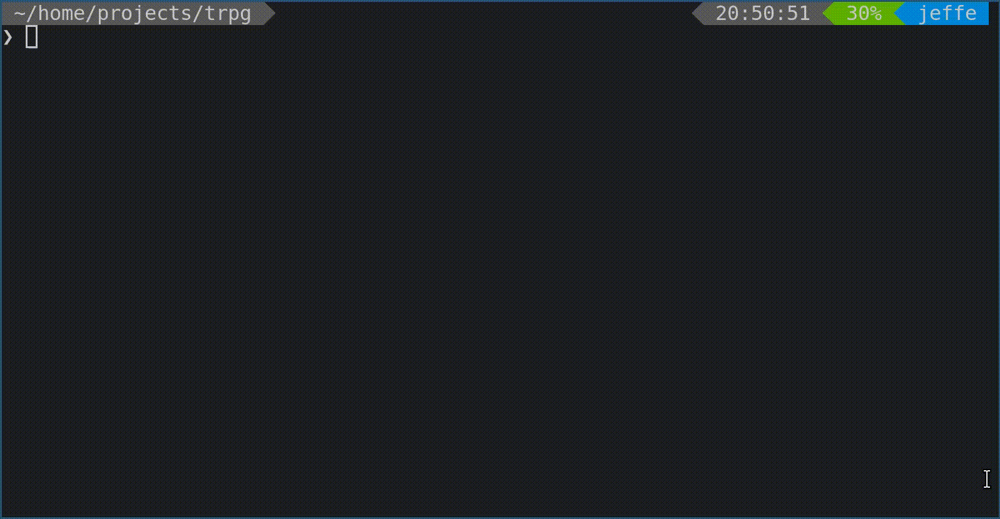

Text based adventure game. The goal is to have fun building world(s) and creating a sense of creation.

There are two kinds of code here. 

Objects.py, and Game.py are examples of code mean to be edited by a developer (but anyone is welcome).

Worlds.py is meant to be where people can create worlds through code and text. It should be much simpler.

